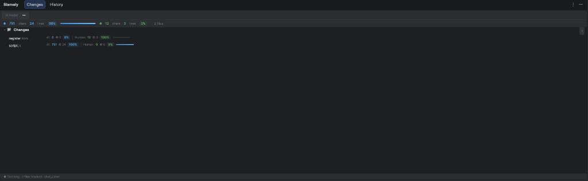
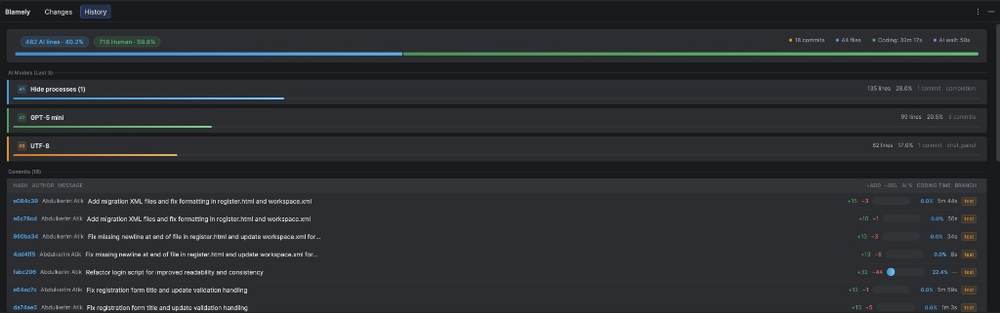
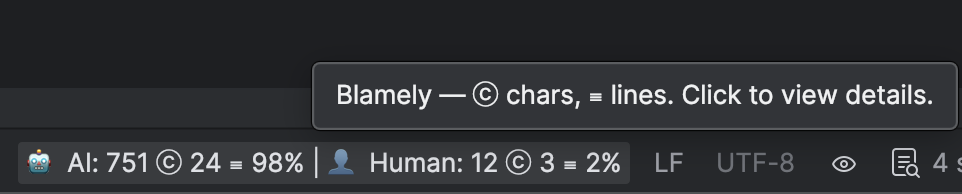

# Blamely — IntelliJ / JetBrains IDE Plugin

<p align="center">
  
</p>

Track, report, and commit **AI / Human** code attribution in IntelliJ IDEA and other JetBrains IDEs. This plugin is a **port of the [Blamely VS Code extension](../)** — it uses the **same data format and directory layout** (`.git/blamely`) so projects can be used in both IDEs with shared attribution data.

**Landing page:** [docs/landing.html](docs/landing.html) — single-page overview and how to use. Learn more at [blamely.ai](https://blamely.ai).

## Screenshots

| Changes tab — per-file AI / Human breakdown | History tab — commits, authors, AI models | Status bar — click to open details |
|------------------------------------------|-------------------------------------------|-------------------------------------|
|  |  |  |

## Features

- **Line-level blame** — Attribute each line to AI or human (95% rule: line is AI if ≥95% of its characters came from AI).
- **Repo-local branch sessions** — Per-branch working state under **`.git/blamely/<sanitized-branch>/`** (`open/`, `stash/`, `closed/`, `trace/`, `report.yml`) and blame snapshots under **`.git/blamely/snapshots/<sanitized-branch>/`**. **IntelliJ** mirrors session JSON under **`~/.blamely/intellij/repos/<repoKey>/sessions/<id>/blamely.json`** (not under the project). Legacy **`blamely/sessions`** files from VS Code are copied forward once if present (otherwise unchanged). Legacy **`~/.blamely/session/{repoKey}/{branch}/`** is still **read** for migration (override with **`BLAMELY_SESSION_HOME`** for tests).
- **Persistence under `.git/blamely`** — Per-branch line blame snapshots and coding metrics in the repo.
- **Branch sessions UI** — The **Blamely → Changes** tool window shows the current branch badge, open session activity, stash line, recent closed commits, and **Show changes** (opens a read-only `git show` summary for the session commit).
- **Pre-commit / pre-push hooks survive plugin upgrades** — Hook logic lives in **`.git/blamely/hookRunner-*.sh`** and `.git/hooks/pre-commit` / `.git/hooks/pre-push` invoke that absolute path. Upgrading or uninstalling the IntelliJ plugin no longer breaks the hooks.
- **Per-branch `report.yml`** — Generated on save (toggleable) and after each commit at **`.git/blamely/<sanitized-branch>/report.yml`**, alongside the rolled-up `.git/blamely/report.yml`.
- **Git notes integration** — `report.yml` summary attached to each commit via `git notes --ref=blamely`. `addGitNote` returns a structured result; failed attaches surface a clear notification with stderr.
- **Tool window** — Per-file AI / Human summary in the **Blamely** tool window (bottom).
- **Gutter markers** — Icons in the gutter for lines with blame (AI / Human).
- **Actions** — Available under **Tools → Blamely**:
  - **Generate Report Now** — Regenerate `report.yml` (root + per-branch) and persist blame state.
  - **Show Blame for Current File** — Show AI / Human counts for the active file.
  - **Install Git Commit Hook** — Install pre-commit/pre-push hooks via the stable `.git/blamely/hookRunner-*.sh` runners.
  - **Restore/Remove Git Hook** — Restore from `.blamely.backup` or strip the Blamely block from existing hooks.
  - **Show Report for Latest Commit (Git Note)** — Load report from git note and open it in the editor.
  - **Show Changes for Commit/Session...** — Read-only `git show` summary for a SHA pasted by the user (also reachable from the Changes tool window).
  - **Push AI Notes to Remote** — Push `refs/notes/blamely` to origin (run after **VCS → Push** so the remote has the notes).
  - **Show Memory / Diagnostics** — Approximate plugin memory (BlameMap + TraceStore) and how to capture a heap snapshot.

## Reference: VS Code Extension

This plugin is based on the [Blamely VS Code extension](../) in the same repository. It reuses:

- **Data model**: `LineBlame`, `BlameMap`, `TraceStore` (same fields and semantics).
- **Storage**:
  - `.git/blamely/snapshots/<branch>/session.json` (coding metrics per branch)
  - `.git/blamely/snapshots/<branch>/<file>.blame.json` (line blame per branch)
  - `.git/blamely/<branch>/{open,stash,closed}/` (session lifecycle, repo-local — same as VS Code 1.x)
  - `.git/blamely/<branch>/report.yml` (per-branch report)
  - `.git/blamely/hookRunner-*.sh` (stable pre-commit/pre-push runners)
  - **`~/.blamely/intellij/repos/<repoKey>/sessions/<id>/blamely.json`** (IntelliJ session mirror — outside repo)
  - **`<repo>/blamely/sessions/<id>/blamely.json`** is the VS Code pushable mirror; IntelliJ does not write here (existing files may be migrated once into `~/.blamely/intellij/…`)
  - `~/.blamely/session/{repoKey}/{branch}/` is **legacy / read-only** and migrated lazily on first use of each branch.
- **Report format**: `report.yml` (scope, branch, commit_hash, files with ai_lines_added, etc.).
- **Git notes**: Same ref `refs/notes/blamely` and note content format (YAML + blame_snapshot).

You can open a project in VS Code or IntelliJ with Blamely and keep a single source of truth under `.git/blamely`.

## Build & Run

- **Requirements**: JDK 17 (Kotlin compiler requires Java 17 or 21; avoid Java 25+ for now). Gradle 8.13+ (wrapper is in the repo).
- **Build** (from project root):
  ```bash
  export JAVA_HOME=$(/usr/libexec/java_home -v 17)   # or point to JDK 17
  ./gradlew build
  ```
- **Build distributable plugin** (creates installable `.zip`):
  ```bash
  export JAVA_HOME=$(/usr/libexec/java_home -v 17)
  ./gradlew buildPlugin
  ```
  Output: **`build/distributions/*.zip`** — install via **Settings → Plugins → ⚙️ → Install Plugin from Disk**.
- **Release / Marketplace ZIP** (clean build + Kotlin release flags + **ProGuard obfuscation**):
  ```bash
  ./release-build.sh
  ```
  See **[RELEASING.md](RELEASING.md)** for tags, GitHub Releases, and what `-Pblamely.obfuscate=true` keeps (extension points in **`proguard/blamely-release.pro`**).
- **Run IDE with plugin (recommended)**:
  ```bash
  ./run-sandbox.sh              # Blamely + Git only (fast sandbox)
  ./run-sandbox.sh --copilot    # Adds GitHub Copilot from Marketplace; sign in inside that IDE window
  ./run-sandbox.sh --full       # Loads every bundled IC 2023.2 plugin listed in sandbox-full-plugins.txt
  ```
  Same as `./gradlew runIde`; optional Gradle props `-Pblamely.sandbox.copilot=true` and `-Pblamely.sandbox.full=true`.
  Use the IDE window Gradle opens — your everyday IntelliJ install does not load this dev build unless you install **`build/distributions/*.zip`** via **Settings → Plugins**.
  Gradle **prepareSandbox** resets the sandbox `plugins/` folder each run (plugins installed only inside that IDE vanish); use **`--copilot`**, declare deps in **`build.gradle.kts`**, or unpack extras into **`sandbox-extra-plugins/`** (see **`sandbox-extra-plugins/README.txt`**).

## CI & Release (GitHub Actions)

- **CI** (on push/PR to `main` or `master`): runs `./gradlew build`, `test`, and **`buildPlugin`** (no obfuscation — faster PR feedback).
- **Release** (when you push a tag **`v*`**): runs **`buildPlugin`** with **`-Pblamely.release=true -Pblamely.obfuscate=true`**, then attaches the ZIP to a GitHub Release.

Full checklist: **[RELEASING.md](RELEASING.md)**.

To publish a new release:

1. Set the same version in **`build.gradle.kts`** (`version = "…"`) and **`src/main/resources/META-INF/plugin.xml`** (`<version>…</version>`).
2. Commit and push, then create and push a tag (**`v`** + version, e.g. **`v1.1.0`**):

   ```bash
   git tag -a v1.1.0 -m "Release v1.1.0"
   git push origin v1.1.0
   ```

3. The **Release** workflow builds an **obfuscated** plugin ZIP and publishes it on GitHub.

## Pushing notes to remote (automatic)

Notes are pushed to the remote **automatically** when you push:

- **Pre-push hook** — `.git/hooks/pre-push` invokes `.git/blamely/hookRunner-pre-push.sh` (a stable script Blamely writes the first time the plugin runs in a repo). The runner shells out to `git push <remote> refs/notes/blamely` whenever you push (from the IDE or CLI). **Your existing pre-push hook is never overwritten:** if you already have a hook, Blamely only appends a small block that calls the runner. Because the runner lives in the repo's git directory by an absolute path, **upgrading or uninstalling the IntelliJ plugin does not break the hook**.
- **IDE listener** — If your IDE supports it, the plugin also subscribes to push completion and pushes notes after **VCS → Push**.
- **Manual** — You can still run **Tools → Blamely → Push AI Notes to Remote** or `git push origin refs/notes/blamely` anytime.

## Settings

`Settings → Tools → Blamely`. Mirrors the VS Code extension's `blamely.*` namespace:

- **Show line icons in gutter** ↔ `blamely.showGutterDecorations`
- **Auto-install Blamely git hooks on project open** ↔ `blamely.autoInstallHook`
- **Generate report.yml on document save** ↔ `blamely.reportOnSave`
- **AI suggestion timeout (ms)** ↔ `blamely.suggestionTimeout`
- **Exclude path patterns** ↔ `blamely.excludePatterns` (one per line; substring match on project-relative paths)
- **Additional exclude patterns** ↔ `blamely.additionalExcludePatterns` (merged with the list above; default includes `.snap`)

## Configuration

Per-branch working state and snapshots live under `.git/blamely`; **IntelliJ** mirrors session metadata under **`~/.blamely/intellij/repos/<repoKey>/sessions/`** (not in the workspace). Excluded paths are configurable under **Settings → Tools → Blamely** (same defaults as the VS Code extension); substring patterns prevent attribution noise under `node_modules`, `.git`, build dirs, `.snap`, and similar paths.

### Migration from `~/.blamely/session/`

Earlier versions stored open/closed session records under `~/.blamely/session/{repoKey}/{branch}/`. They are still **read** so nothing is lost during the upgrade; on first interaction with a branch the plugin copies any legacy `open/`, `closed/`, and `stash/` files into the new repo-local layout. Tests can override the legacy home with the `BLAMELY_SESSION_HOME` environment variable so they do not touch the real `$HOME/.blamely`.

## Report format (same as VS Code)

```yaml
scope: "this_commit"
generated_at: "2026-03-05T12:00:00Z"
detector_version: "0.1.0"
branch: "main"
commit_hash: "abc12345"
commit_message: "feat: add feature"

ai_sources:
  - intellij_ai

agent_info:
  ide: "IntelliJ"
  models: []

files:
  - path: "src/Main.kt"
    source: "intellij_ai"
    model: "unknown"
    ai_lines_added: 5
    human_lines_added: 10
    ...
```

## Checking plugin memory usage

Blamely runs inside the IDE JVM, so it does not have a separate process. To see how much memory the plugin uses:

1. **In-plugin summary**  
   **Tools → Blamely → Show Memory / Diagnostics** shows approximate in-memory usage for the current project (BlameMap: files and line entries, TraceStore: suggestions, rough KB estimate) and a reminder to capture a full snapshot.

2. **IDE heap snapshot (plugin objects only)**  
   - **Help → Diagnostic Tools → Capture Memory Snapshot** (or **Capture Heap Dump** on some versions).  
   - After the snapshot opens, use the search/filter and type **`blamely`** or **`ai.blamely`** to list objects owned by the plugin.  
   - You can inspect retained size and instance counts per class.

3. **Profiler (live)**  
   - **View → Tool Windows → Profiler** (if available), then start a session and capture a memory snapshot.  
   - In the snapshot view, filter by package **`ai.blamely`** to see plugin allocations.

4. **Debugger Memory tab**  
   - When debugging the IDE (e.g. Run Plugin), open **View → Tool Windows → Debug → Memory**, click **Load classes**, and look for **`ai.blamely`** in the list to see live object counts.

## License

Blamely for IntelliJ is released under the **MIT License**. See **[LICENSE](LICENSE)** for the full text.

This matches the **[VS Code extension LICENSE](reference-project/vscode-plugin/LICENSE)** in this repo so both IDEs can share the same terms when you use the shared `.git/blamely` format.

When you publish on **JetBrains Marketplace**, choose **MIT** (or your vendor’s equivalent) in the listing so it matches this repository.
